# 3D printer particle scanner

## Parts List

### 3D Printer
We use the cheap open-source Creality Ender 3 3D printer as the stage

Either the [Creality Ender 3 Pro](https://www.creality3dofficial.com/collections/ender-series/products/creality-ender-3-pro-3d-printer) or Creality Ender 3 V2 (https://www.creality3dofficial.com/collections/ender-series/products/ender-3-v2-3d-printer)

You will also need some **1.75mm PLA** filament for printing if you do not have any already.

| Part | Supplier | Part Number | Description | Link |
| --- | --- | --- | --- | --- |
| 3D Printer | Creality | Ender 3 Pro | Cheap 3D printer | https://www.creality3dofficial.com/collections/ender-series/products/creality-ender-3-pro-3d-printer |
| Filament | Creality | 1kg Ender PLA Filament | Black PLA filament used for 3D printing | https://www.creality3dofficial.com/products/1kg-ender-pla-filament |
| USB Cable | Any | Any | USB 2.0  cable (A Male to Mini B) for connecting computer to printer | e.g. https://www.amazon.com/AmazonBasics-USB-2-0-Cable-Male/dp/B00NH11N5A |

### Imaging system

| Part | Supplier | Part Number | Description | Link | Image |
| --- | --- | --- | --- | --- | --- |
| Camera | Basler | acA2440-35uc | 5MP USB3 colour machine vision camera | https://www.baslerweb.com/en/products/cameras/area-scan-cameras/ace/aca2440-35uc/ |
| USB Cable | Any | Any | USB 3.0 cable (A Male to Micro B) for communication with camera | e.g. https://www.amazon.com/AmazonBasics-USB-3-0-Cable-Male/dp/B00NH12R1O |
| Objective | VS Technology | VS-TCH4-65 | 4x magnification telecentric lens | https://vst.co.jp/en/machine-vision-lenses-en/vs-tch-series/ |
| Lighting | VS Technology | VL-LR2550W | White ring lighting | https://vst.co.jp/en/lighting-en/vl-lr-series/ |
| Lighting Power Supply | Any | Any | 24V 1A power supply with 2.1mm DC plug | e.g https://www.amazon.fr/gp/product/B09CPDTMV9?ref=ppx_pt2_dt_b_prod_image | 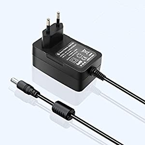 |
| Adapter | Any | Any | 2.1mm DC socket to screw terminal | e.g. https://www.amazon.com/Connector-Adapter-JEEUE-Female-Security/dp/B07SVD4PC3 | 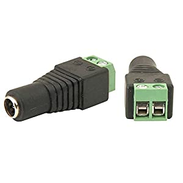 |
| Wire to 3 pin JST | Any | Any | 2.1mm DC socket to screw terminal | e.g. https://www.amazon.com/Connector-Adapter-JEEUE-Female-Security/dp/B07SVD4PC3 | 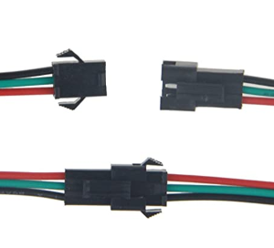 |

### Misc.

* 4 x 10mm M3 bolts
* 2 x 20mm M3 bolts
* 6 x M3 washer
* 1 x 15mm M4 bolt
* 1 x M4 nut
* Power board with individual switches

## Build Instructions

### 1. Build 3D Printer

Follow the Creality manufacturers instructions to build the 3D printer

This youtube video shows the overall process. Pay attention from 10:00 onwards to how to adjust the nuts to tighten up the bed wobble.

https://www.youtube.com/watch?v=gokN9xNG94U

Note the following tricks:

* When levelling the bed, make sure the knobs under the bed have about 7mm of thread out the bottom. This is roughly the middle and will give enough room for later adjustments.
* Check if the bed has some wobble. If it does, tighten the hex nuts that attach it to the rail (see video above)

### 2. Build the camera and lighting holders

Print these two parts (located in the components directory)

- CameraObjectiveHolder.stl
- LightingHolder.stl

### 3. Assemble lighting

Attach the lighting to the lighting holder using 2 x 10mm M3 bolts and nuts:

 

Attach the lighting holder to the camera holder using 1 x 15 mm M4 bolt and nut. The nut is on the front:

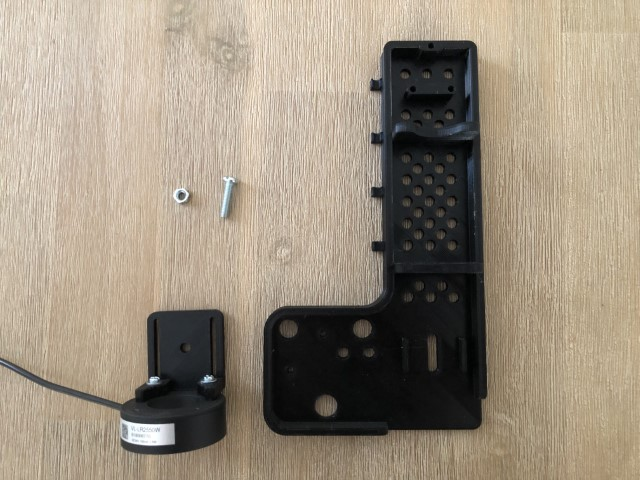 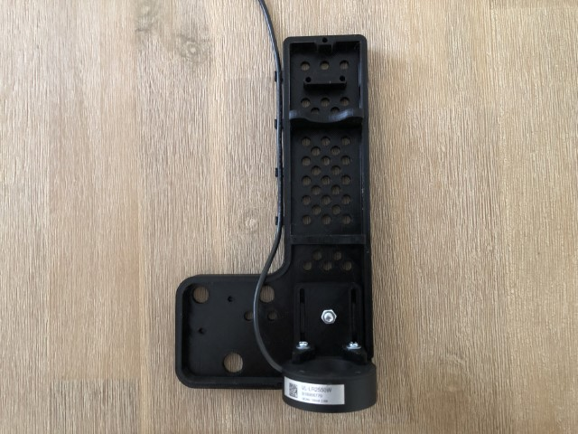

Screw the wires from the female JST plug into the adaptor, ensuring that the polarity is correct. Plug the adaptor into the 24V power supply and the JST into the lighting. Turn on the power supply to make sure the lights come on.

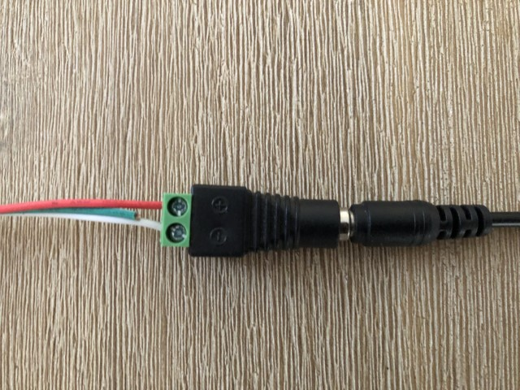 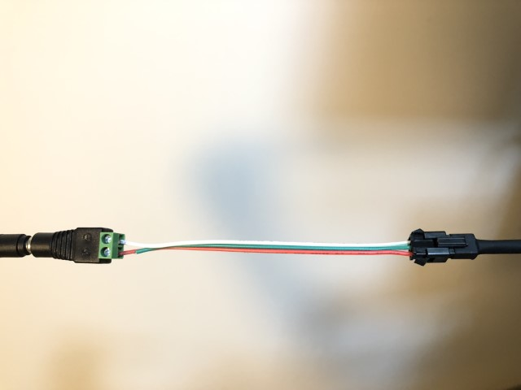

### 4. Assemble camera

Attach the camera to the camera holder using 2 x 10mm M3 bolts and nuts. **It is difficult to line up the angles perfectly, DO NOT FORCE IT! The bolts will screw in easily if correct.** Hint: try to do both at the same time, rather than one at a time. Once both are in, screw in all the way with fingers, then use a screwdriver for the final tighten. Secure the bottom of the lens to the holder with a rubber band or tie. 

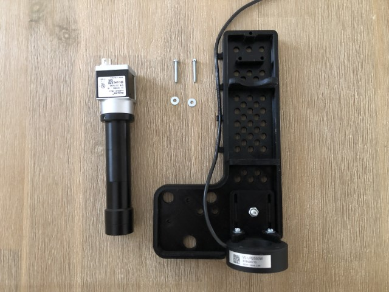 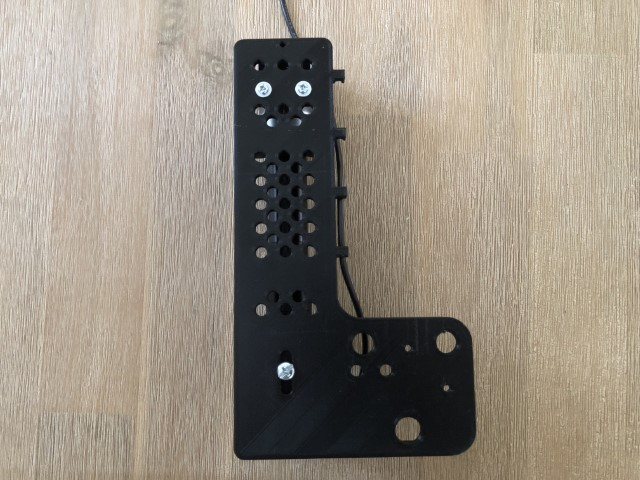

### 5. Attach to 3D Printer

Lower the Z-stop sensor all the way to the bottom:

Remove the printer head. Attach the camera holder to the printer using 2 x 10mm M3 bolts and nuts:

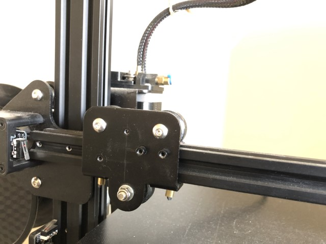 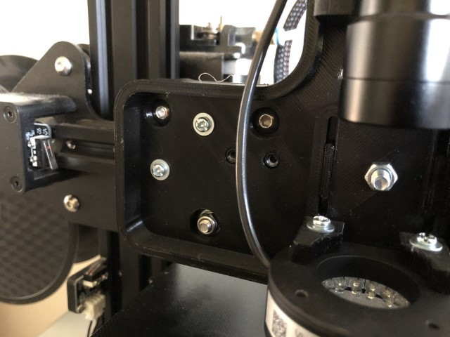

Plug the USB3 cable into the camera. Using some cable ties or wire twists, join the camera USB cable and the lighting cable together for about 50cm. Using a rubber band or tape, secure the two cables tightly to the upper-right of the frame, so that the cables make an arc. This is to reduce pressure on the camera when it moves.

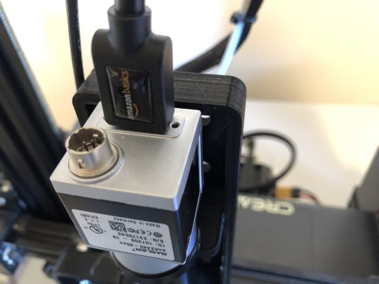 

### 6. Adjust printer

Place the glass plate on the bed. The glass plate is needed because it is very flat. Adjust the screws under each corner so there is approximately 8-9 mm of thread at the bottom. 

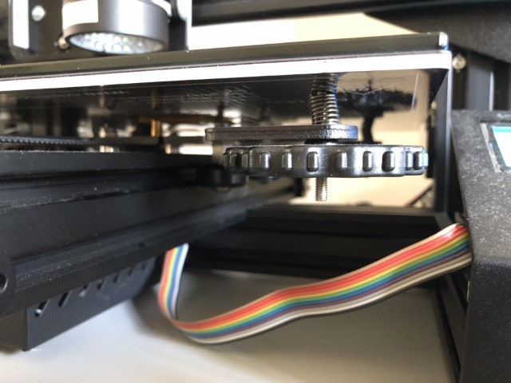

If the bed is wobbly, adjust the nuts at the bottom (turning the nuts moves the wheels closer / further from the rail). Don't over tighten, the bed should still move freely on the y axis.

Connect the printer power supply and USB communication cable to the computer.

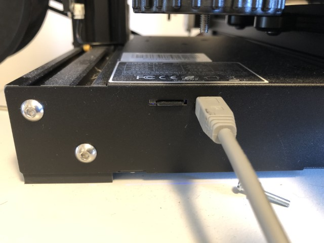

## Driver Installation

Install the [Basler Pylon Camera Software Suite](https://www.baslerweb.com/en/sales-support/downloads/software-downloads/#type=pylonsoftware;language=all;version=all). If prompted for which driver to install, select USB3.

Confirm the installation has worked by connecting the camera to your computer using the USB3 cable and running **pylon Viewer**

## Software Installation (Python)

### 1. Install Python

The software needs python 3.7 or later. The easiest way to install python is to use Anaconda.

### 2. Install Sashimi

Download this repository either using git or as a zip file.

Open a terminal inside the `python` directory of this repository.

Run `pip install -e .`. Using `-e` means this will install this software as a linked package inside your python installation. Whenever you update the software in this repository, the changes will automatically be available.

## Usage (Python)

### 1. Start the printer

Turn on the printer and lighting power.

### 2. Launch software

From a terminal in your python environment, run 

`python -m sashimi.cli scan --dir DIRECTORY/TO/SAVE/IMAGES --port PORT --lang en`

- `--dir` is the directory to save images in
- `--port` is the serial port that the 3D printer is connected to
- `--lang` is the language / keyboard of the interface. Only english (US keyboard) (en) and french (fr) are supported. 

The printer will move the camera to the home location and the following window will be displayed:

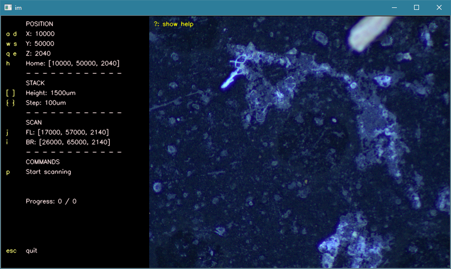

### 3. Calibrate

Calibration normally only needs to be done infrequently.

1. Move the camera to the front-left of the base plate. Normally this is the position after start up. 
2. Move the camera up or down so that the base plate is in focus.
   - en: `q`/`e`
   - fr: `a`/`e`
3. (Optional) Press the `h` key to set the home position. The scanner will start at this position from now on.
4. Move the camera to the front-right of the base plate. Adjust the screw wheel under the plate so that the image is in focus.
5. Repeat for the back-right and back-left positions

### 4. Set scan parameters

1. Move the camera to the front-left of the area to scan. Press `j` to save the position.
2. Move the camera to the back-right of the area to scan. Press `i` to save the position.
3. Use `[` and `]` to set the height of the stack. It is good to add a bit extra.
4. Use `{` and `}` to set the height step of the stack. 60um is recommended for the VS-TCH4-65 lens.
6. Use `g` and `t` to adjust the camera exposure.

### 5. Start scan

Press `p` to start the scan. The progress will be displayed on screen.

### 6. Fuse images (laplacian pyramid)

Once scanning is complete, from a terminal in your python environment, run 

`python -m sashimi.cli stack --dir DIRECTORY/OF/STACKED/IMAGES`
 
where `--dir` is the directory containing the individual directories for each stack. 

### 6. Fuse images (helicon)

Alternatively, if you have Helicon Focus installed, you can run the following command to use that stacker instead.

`python -m sashimi.cli helicon-stack --dir DIRECTORY/OF/STACKED/IMAGES`

